# Enhancing Applications

# RUBRIC

## Set Up of Application Insight

### Create appropriate Azure resources to utilize Application Insights and Azure Log Analytics.

Azure Log Analytics Workspace and Azure Application Insights resources are created.

As evidence, provide a screenshot of the resource group containing your running resources.

The resource group `acdnd-c4-project` containing the running resources:

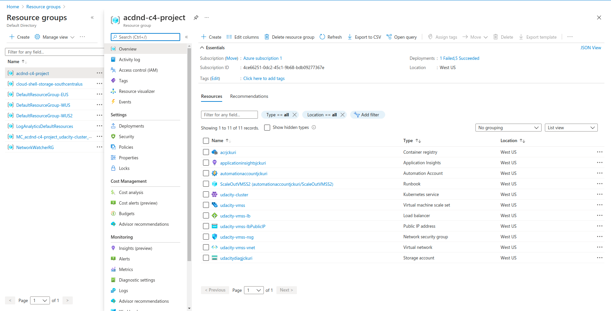

And here are all the resources I created for this project:

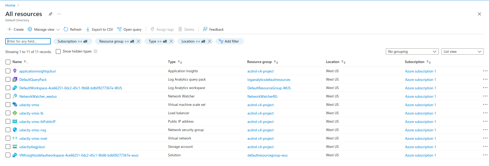

### Enable Application Insights for a VM Scale Set.

Application Insights monitoring is enabled on the VMSS.

As evidence, provide a screenshot of the metrics from the VM Scale Set instance. This should show the following information:

- CPU %
- Available Memory %
- Information about the Disk
- Information about the bytes sent and received.

There will be 7 graphs that display this data.

The Application Insights enabled:

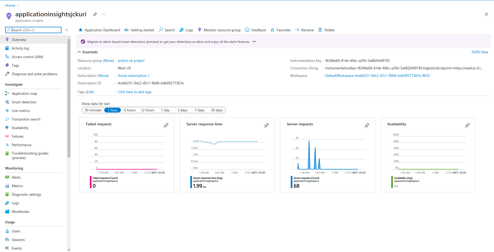

And the insights of the VMSS `udacity-vmss` with the 5 graphs:

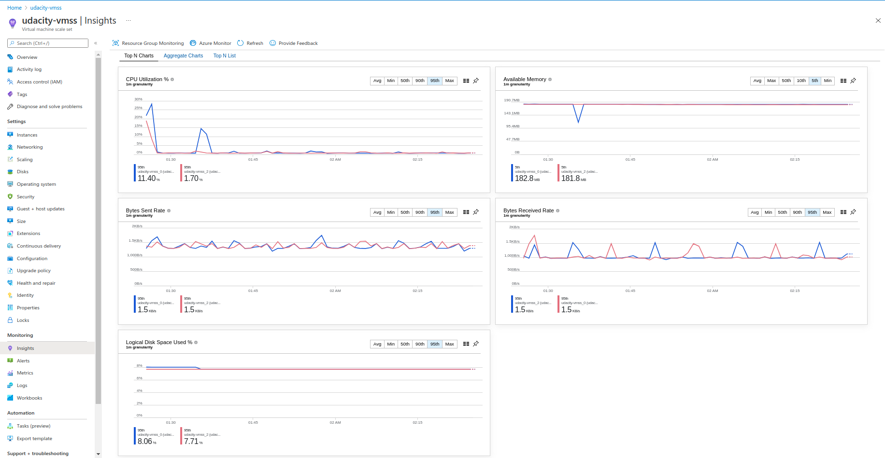

### Enable Application Insights on an AKS cluster.
	
Enable Application Insights on the AKS cluster created from the provided script create-cluster.sh.

As evidence, provide a screenshot showing Application Insights is enabled on the AKS cluster.

The Application Insights is enabled on the AKS cluster:

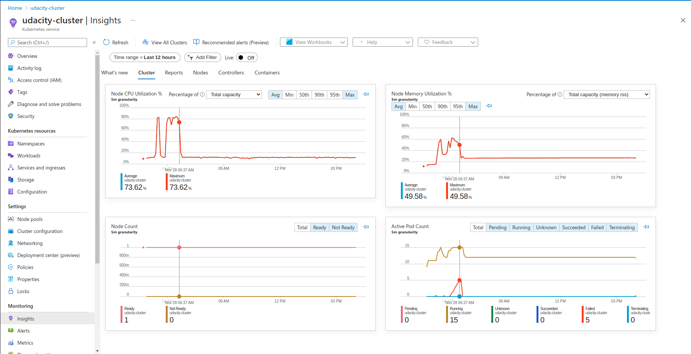

### Create an Azure Alert.

Create an Azure Alert in Azure Monitor. This alert should trigger when the number of pods increases beyond a certain threshold.

As evidence, provide a screenshot of the Azure Alert and email sent when the alert is triggered.

My alert rule activates whenever the average number of active pods is greater than `14.5`.
Here are the moments in which the alert rule was activated:

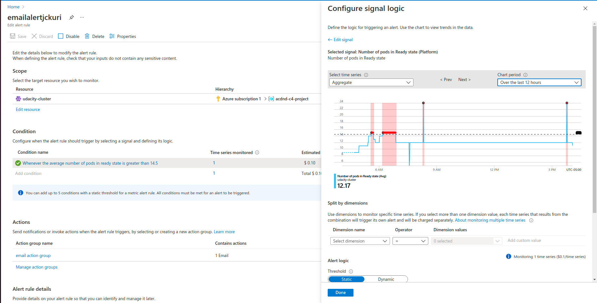

The e-mail I received when the alert was triggered:

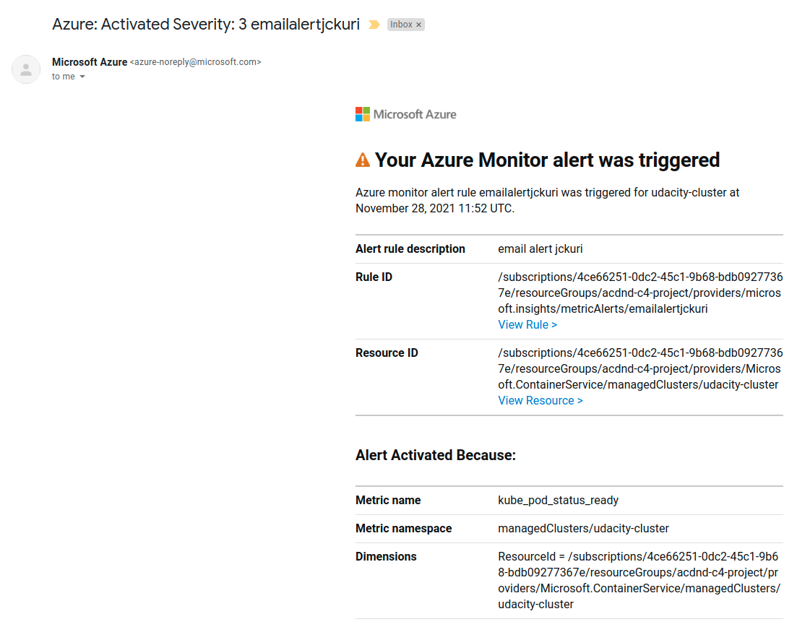

### Create a horizontal pod auto scaler and cause load on the container.

Create a horizontal pod autoscaler and cause load on the container.

As evidence, provide screenshots showing:

1. The output of the Horizontal Pod Autoscaler, showing an increase in the number of pods.

These are the initial pods. Notice there is only one `azure-vote-front` pod:

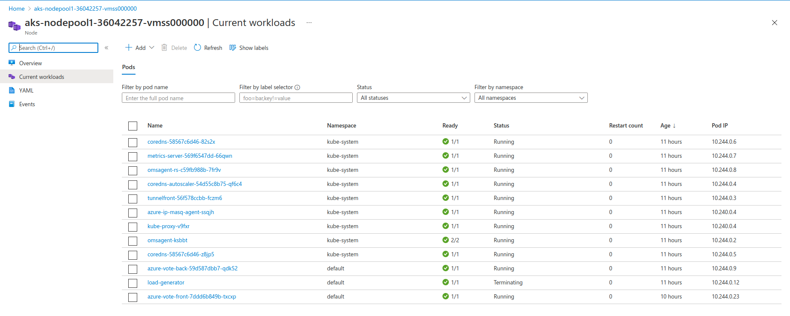

Then I execute this command to know the external IP of the LoadBalancer:

```
$ kubectl get service
NAME               TYPE           CLUSTER-IP    EXTERNAL-IP     PORT(S)        AGE
azure-vote-back    ClusterIP      10.0.36.67    <none>          6379/TCP       25h
azure-vote-front   LoadBalancer   10.0.22.238   40.85.149.193   80:32630/TCP   25h
kubernetes         ClusterIP      10.0.0.1      <none>          443/TCP        26h
```

**The AKS cluster is running the Vote Web App in the address: [http://40.85.149.193/](http://40.85.149.193/)**

I execute this command to run the `load-generator`:

```
kubectl run -it --rm load-generator --image=busybox /bin/sh
```

Once inside the `load-generator`, I execute this infinite while loop to overload the LoadBalancer:

```
while true; do wget -q -O- 40.85.149.193; done
```

As a result, an infinite number of requests are asked to the LoadBalancer:

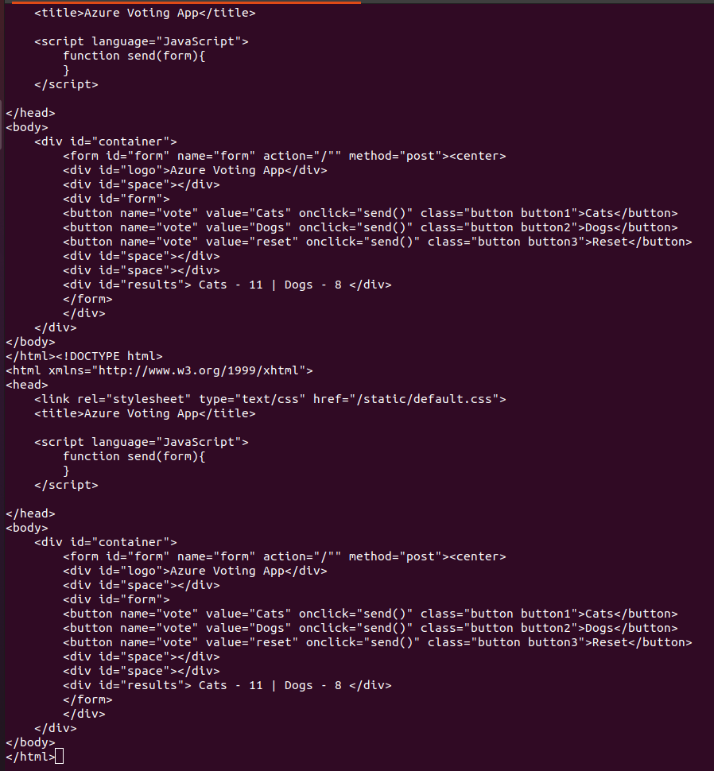

The AKS cluster is overloaded. And the alert is triggered:


As a result, new pods are created. Notice that now there are 3 `azure-vote-front` pods:

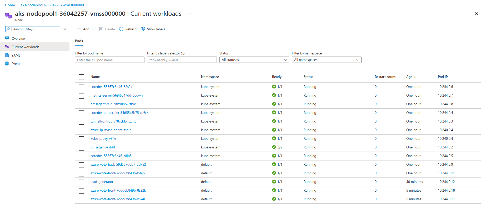

2. The Application Insights metrics which show the increase in the number of pods.

The average of Active Pod Count is now 15, enough to activate the alert rule:


3. The email you received from the alert when the pod count increased.

I received this e-mail as a result that the alert was triggered:


## Analyzing Performance Metrics

### Import and reference the correct libraries to enable the collection of Application Insights telemetry data.
	
In the provided main.py of the application:

Import and reference the correct libraries for Application Insights

Add code to reference the Application Insights Instrumentation key. The objects that will use this key include:
exporter, tracer, flask middleware, logger

References to each of these objects should be found in the def index() function.

|  **READ THE FILE: [azure-vote/main.py](azure-vote/main.py)**  |
|---------------------------------------------------------------|

### View and display the collected data in Azure Application Insights & Azure Log Analytics.

As evidence, provide screenshots of:

1. Application Insight Events that show the results of clicking vote for each Dogs & Cats

The event statistics shows the counts of all the requests, the POST requests, the GET requests, the `Dogs Vote`, and the `Cats Vote`.
The event statistics also shows another log messages that I wrongfully programmed and I couldn't delete after. 
Don't pay attention to them. I filtered them out in the Kusto query.

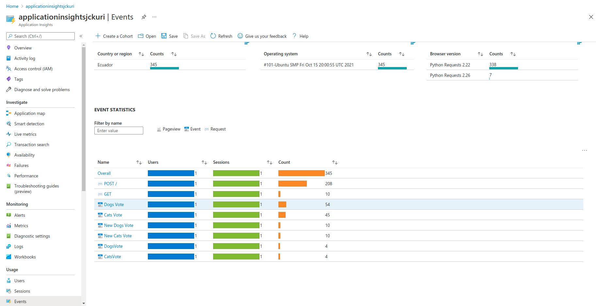

2. The output of the traces query in Azure Log Analytics

The query in the Kusto language <https://docs.microsoft.com/en-us/azure/data-explorer/kusto/query/sqlcheatsheet> selects logs with messages of "Dogs Vote" and "Cats Vote" that were logged 5 minutes ago:

```
traces
| where message == 'Dogs Vote' or message == 'Cats Vote'
| where timestamp > ago(5m)
```

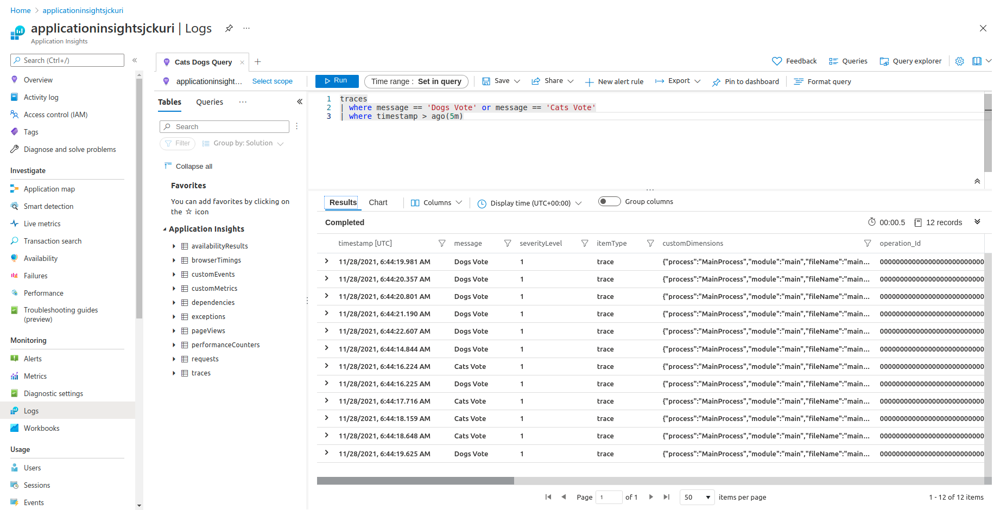

3. The chart created from the output of the traces query

Here is the doughnut graph of the cats votes and the dogs votes.
Notice that the doughnut is asymmetric, not 50%-50%.
Why? Because the instructions in the TODOs of the [azure-vote/main.py](azure-vote/main.py) file are ill-formed.
Read the lines below `# NEW TODO: log current vote` in my [azure-vote/main.py](azure-vote/main.py) file in order to know how I fixed this bug.

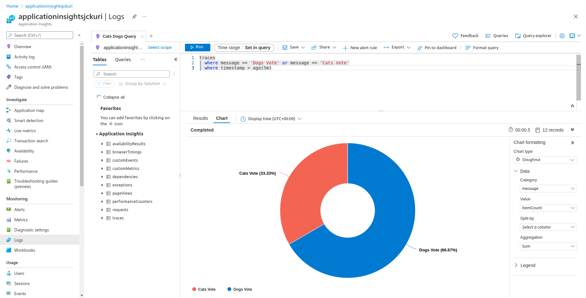

## VM Autoscaling

### Create an auto scaling rule for a VM Scale Set.

Create an auto-scaling rule for a VMSS.

As evidence, provide a screenshot showing the conditions set for the auto scaling rule. This can be found in the Scaling item in the VM Scale Set.

My autoscale rule increases the number of instances by 1 if the average percentage of CPU usage is greater than 50%. 
This rule is applied regardless of the day and the hour.

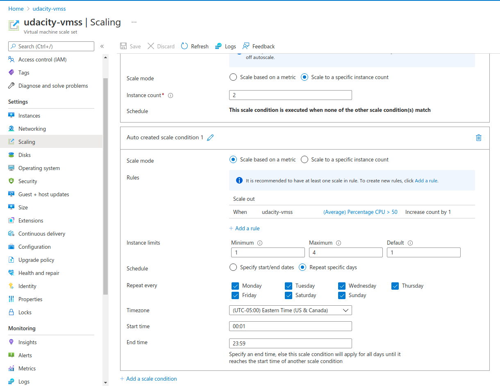

### Cause the VM Scale Set to auto scale.

Trigger the VM Scale Set auto scale rule.

As evidence, provide the following screenshots:

1. The Activity log of the VM scale set that shows it scaled up, including a timestamp.

The autoscale scale up was completed:

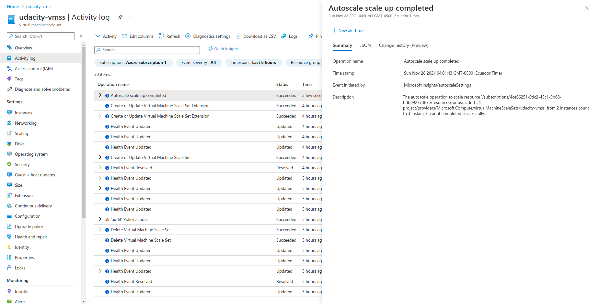

2. The new instances being created.

There are only 2 instances at the beginning:

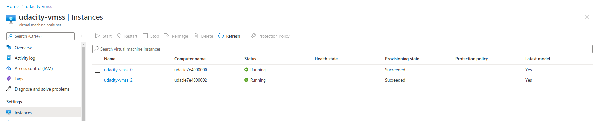

I stress the virtual machine 0 to 100% CPU usage:

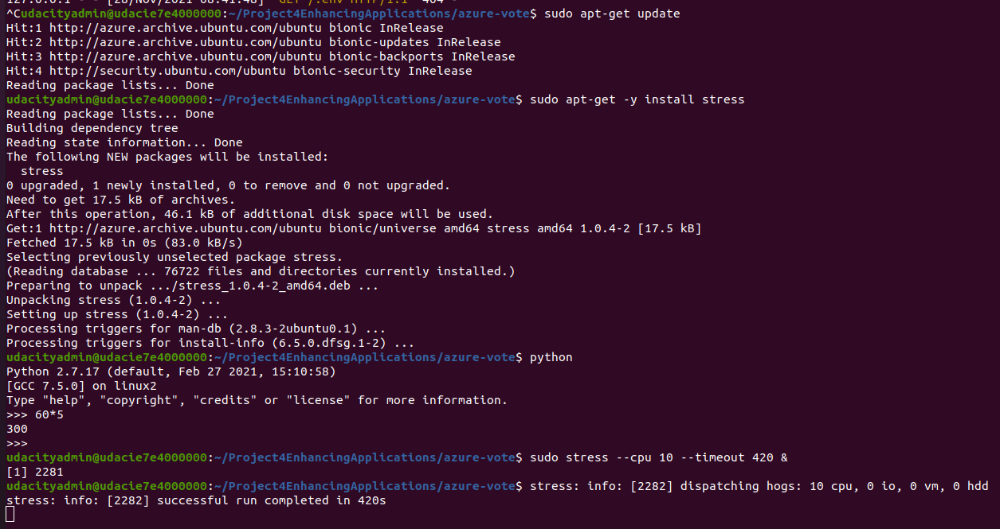

I stress the virtual machine 2 to 100% CPU usage:

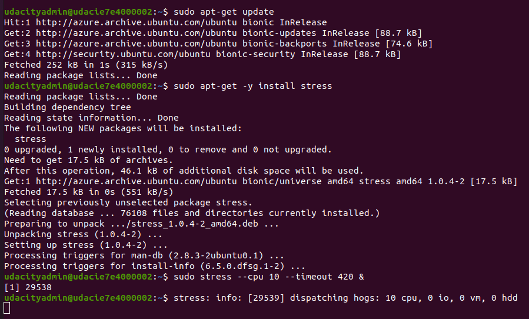

As a result, 2 new instances are created:

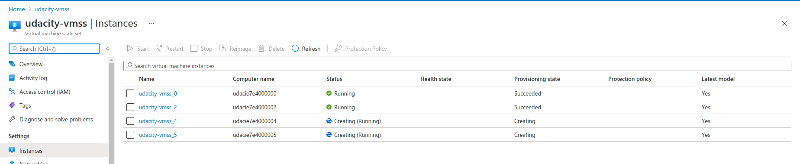

3. The metrics showing the load increasing, then decreasing once scaled up, including a timestamp.

CPU usage increased for 420 seconds (7 minutes) and then decreased:

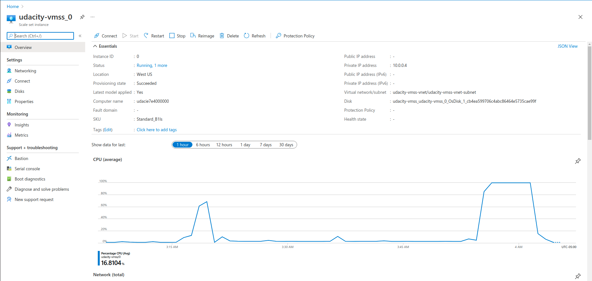

## Automate Resolution of Performance Issues

### Create an Azure RunBook to be executed by an Azure Automation Account.

Azure Automation Account and RunBook resources are created.

As evidence, provide a screenshot of your resource group containing your running resources.

The resource group `acdnd-c4-project` contains the Automation Account `automationaccountjckuri` and the Runbook `ScaleOutVMSS2`:


Here is the source code I programmed for my Runbook `ScaleOutVMSS2`:

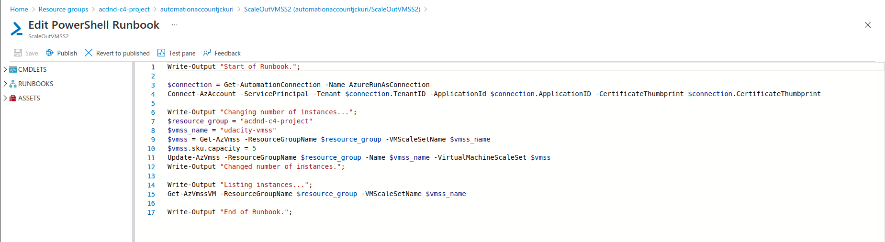

```
Write-Output "Start of Runbook.";

$connection = Get-AutomationConnection -Name AzureRunAsConnection
Connect-AzAccount -ServicePrincipal -Tenant $connection.TenantID -ApplicationId $connection.ApplicationID -CertificateThumbprint $connection.CertificateThumbprint

Write-Output "Changing number of instances...";
$resource_group = "acdnd-c4-project"
$vmss_name = "udacity-vmss"
$vmss = Get-AzVmss -ResourceGroupName $resource_group -VMScaleSetName $vmss_name
$vmss.sku.capacity = 5
Update-AzVmss -ResourceGroupName $resource_group -Name $vmss_name -VirtualMachineScaleSet $vmss
Write-Output "Changed number of instances.";

Write-Output "Listing instances...";
Get-AzVmssVM -ResourceGroupName $resource_group -VMScaleSetName $vmss_name

Write-Output "End of Runbook.";
```

When I programmed my Runbook `ScaleOutVMSS2`, I got inspiration in these tutorials:

Change the capacity of a scale set<br/>
https://docs.microsoft.com/en-us/azure/virtual-machine-scale-sets/virtual-machine-scale-sets-manage-powershell#change-the-capacity-of-a-scale-set

Azure Automation: Managing Runbook Authentication and Modules<br/>
https://cloudskills.io/blog/azure-automation-runbook-2

Create an Azure Automation Account<br/>
https://cloudskills.io/blog/azure-automation-runbook#create-an-azure-automation-account

The last tutorial explains a crucial step. We cannot have access to Azure resources without authenticating properly.
You should enable the option `Create Azure Run As account` in order to simplify this process:

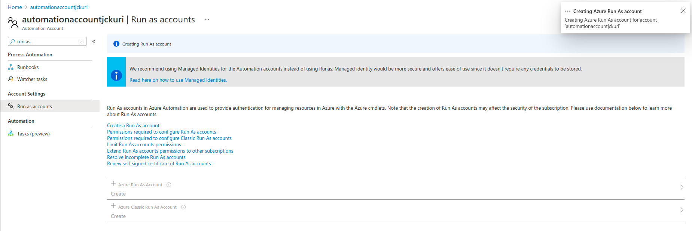

### Configure an Azure Alert to trigger the RunBook to execute.
	
Configure an Azure Alert in Azure Monitor to trigger the RunBook.

As evidence, provide a screenshot of the configuration.

My alert rule triggers when the average percentage of CPU usage is greater than 50%.

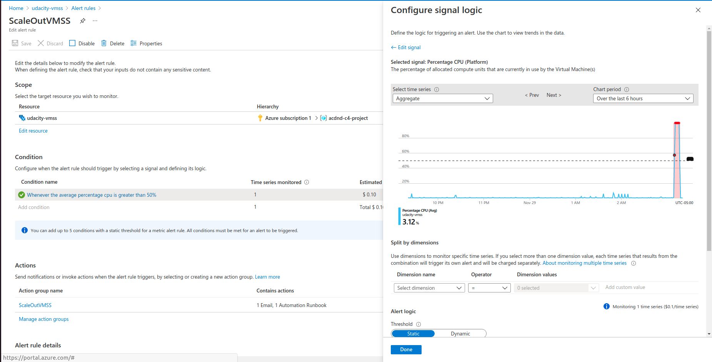

And here the alert rule is triggered:

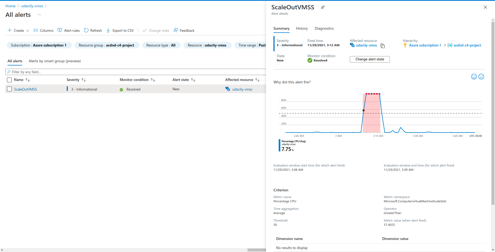

### Cause the RunBook to be automatically triggered and resolve a problem.

Trigger the Azure Alert. The RunBook should execute and resolve the issue.

As evidence, provide the following screenshots:

1. Email showing the alert was triggered

I received this e-mail because the alert rule `ScaleOutVMSS` was triggered for the resource `udacity-vmss`:

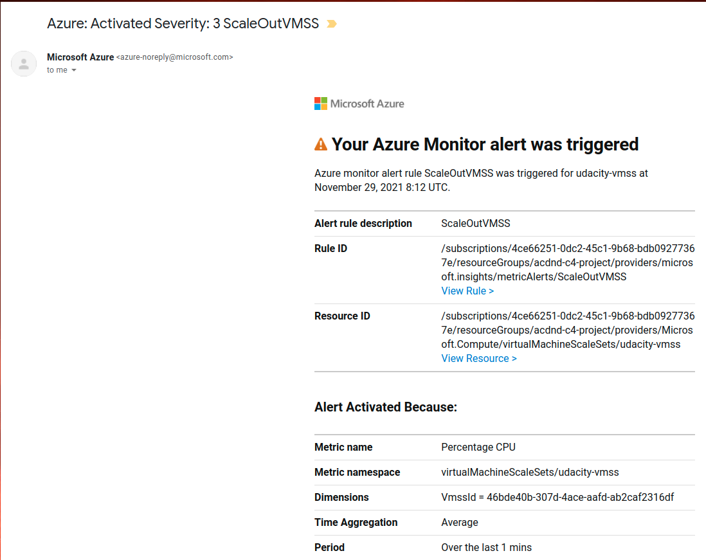

2. Metrics or other evidence showing the RunBook executed and resolved the issue.

At the beginning, I had 2 instances running in my VMSS:

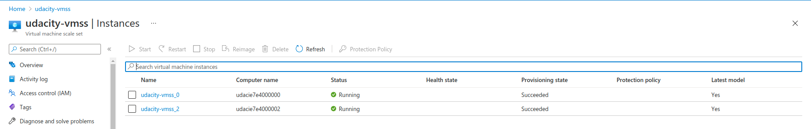

Then I stress the virtual machine 0, using its CPU at 100%:

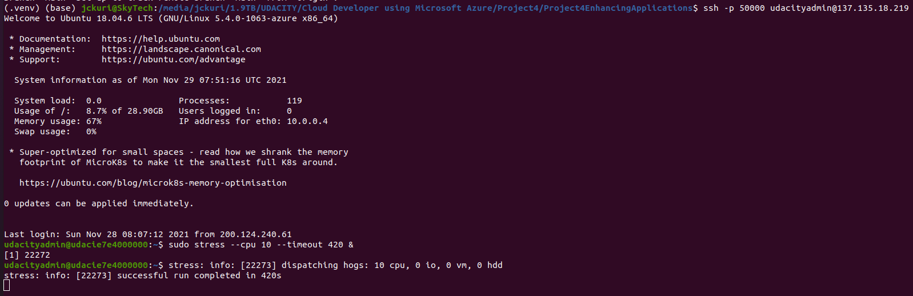

And I stress the virtual machine 2, using its CPU at 100%:

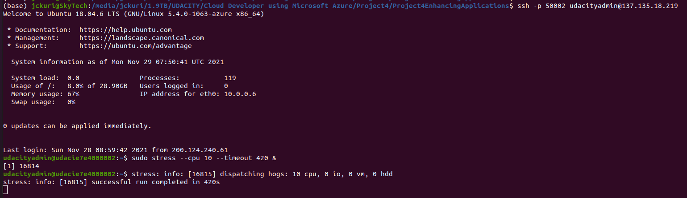

Both virtual machines get fully busy for 420 seconds (7 minutes) in the resource `udacity-vmss`:

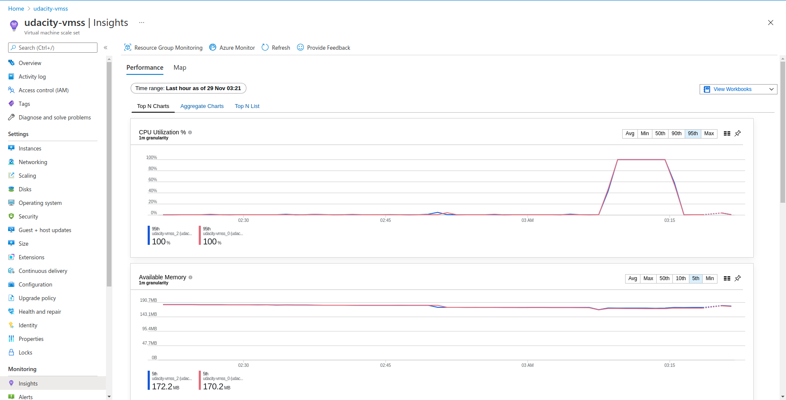

As a result, the alert rule `ScaleOutVMSS` was triggered and the Runbook `ScaleOutVMSS2` was executed,
which creates new instances:

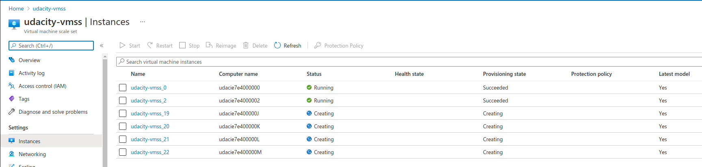

Here is the output of the Runbook `ScaleOutVMSS2` when its execution is completed:

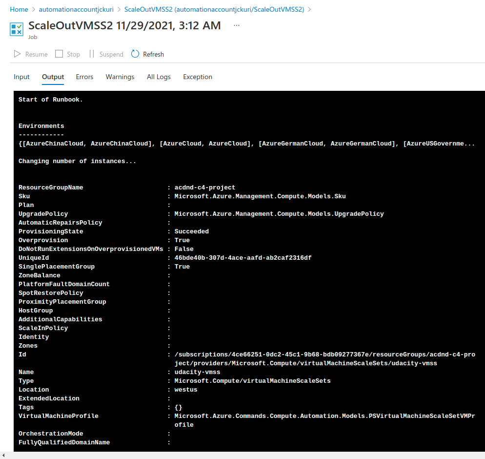

Finally, the number of instances is now 5. The problem of CPU overloaded was remedied:

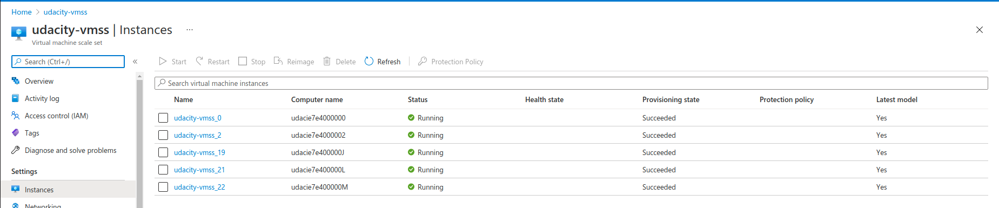

# Former README.md

The former README.md contains general information about the project and how to
install and to run the project: [former_README.md](former_README.md)
