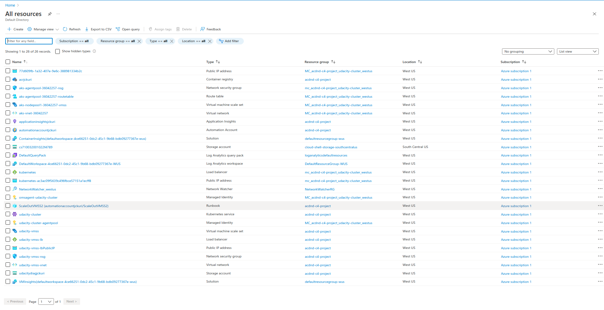

# Enhancing Applications

# RUBRIC

## Set Up of Application Insight

### Create appropriate Azure resources to utilize Application Insights and Azure Log Analytics.

Azure Log Analytics Workspace and Azure Application Insights resources are created.

As evidence, provide a screenshot of the resource group containing your running resources.

### Enable Application Insights for a VM Scale Set.

Application Insights monitoring is enabled on the VMSS.

As evidence, provide a screenshot of the metrics from the VM Scale Set instance. This should show the following information:

- CPU %
- Available Memory %
- Information about the Disk
- Information about the bytes sent and received.

There will be 7 graphs that display this data.

### Enable Application Insights on an AKS cluster.
	
Enable Application Insights on the AKS cluster created from the provided script create-cluster.sh.

As evidence, provide a screenshot showing Application Insights is enabled on the AKS cluster.

### Create an Azure Alert.

Create an Azure Alert in Azure Monitor. This alert should trigger when the number of pods increases beyond a certain threshold.

As evidence, provide a screenshot of the Azure Alert and email sent when the alert is triggered.

### Create a horizontal pod auto scaler and cause load on the container.

Create a horizontal pod autoscaler and cause load on the container.

As evidence, provide screenshots showing:

The output of the Horizontal Pod Autoscaler, showing an increase in the number of pods.

The Application Insights metrics which show the increase in the number of pods.

The email you received from the alert when the pod count increased.

## Analyzing Performance Metrics

### Import and reference the correct libraries to enable the collection of Application Insights telemetry data.
	
In the provided main.py of the application:

Import and reference the correct libraries for Application Insights

Add code to reference the Application Insights Instrumentation key. The objects that will use this key include:
exporter, tracer, flask middleware, logger

References to each of these objects should be found in the def index() function.

READ THE FILE: [azure-vote/main.py](azure-vote/main.py)

### View and display the collected data in Azure Application Insights & Azure Log Analytics.

As evidence, provide screenshots of:

Application Insight Events that show the results of clicking vote for each Dogs & Cats

The output of the traces query in Azure Log Analytics

The chart created from the output of the traces query

## VM Autoscaling

### Create an auto scaling rule for a VM Scale Set.

Create an auto-scaling rule for a VMSS.

As evidence, provide a screenshot showing the conditions set for the auto scaling rule. This can be found in the Scaling item in the VM Scale Set.

### Cause the VM Scale Set to auto scale.

Trigger the VM Scale Set auto scale rule.

As evidence, provide the following screenshots:

The Activity log of the VM scale set that shows it scaled up, including a timestamp.

The new instances being created.

The metrics showing the load increasing, then decreasing once scaled up, including a timestamp.

## Automate Resolution of Performance Issues

### Create an Azure RunBook to be executed by an Azure Automation Account.

Azure Automation Account and RunBook resources are created.

As evidence, provide a screenshot of your resource group containing your running resources.

### Configure an Azure Alert to trigger the RunBook to execute.
	
Configure an Azure Alert in Azure Monitor to trigger the RunBook.

As evidence, provide a screenshot of the configuration.

### Cause the RunBook to be automatically triggered and resolve a problem.

Trigger the Azure Alert. The RunBook should execute and resolve the issue.

As evidence, provide the following screenshots:

Email showing the alert was triggered

Metrics or other evidence showing the RunBook executed and resolved the issue.

# Former README.md

The former README.md contains general information about the project and how to
install and to run the project: [former_README.md](former_README.md)
